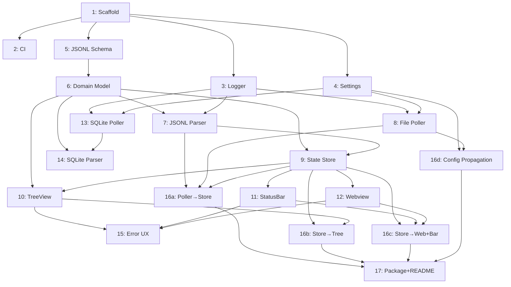

# Agent Context Visualization — VS Code Extension Plan

> Planning-only document. No implementation code.

---

## Table of Contents

1. [Research Brief](#1-research-brief)
2. [Implementation Plan](#2-implementation-plan)
3. [Plan Review Findings](#3-plan-review-findings)
4. [Revised Plan](#4-revised-plan)
5. [Test Plan](#5-test-plan)
6. [Open Questions / Assumptions](#6-open-questions--assumptions)

---

## 1. Research Brief

**Subagent: Researcher**

### 1.1 Feasibility Assessment

Building a VS Code / Cursor extension that reads agent context data and visualizes main-agent plus subagent usage in real time is **feasible** with the following caveats:

- Cursor stores conversation and composer data in a SQLite database (`state.vscdb`) located inside `workspaceStorage/`. The relevant keys are `workbench.panel.aichat.view.aichat.chatdata` (legacy chat) and `composer.composerData` (current composer/agent sessions). This data is not exposed through a stable public API and is subject to change without notice.
- An alternative approach is to support user-configured JSON log files (`.jsonl`) that extensions or hooks can produce, providing a more stable and portable contract.
- The extension can run inside the Cursor fork of VS Code using the standard Extension API (v1.x).

### 1.2 Log Sources and Formats

| Source | Location | Format | Stability |
|--------|----------|--------|-----------|
| `state.vscdb` SQLite — `composerData` | `~/.cursor/…/workspaceStorage/<hash>/state.vscdb` | JSON blob inside SQLite `ItemTable` | **Unstable** — internal, undocumented |
| `state.vscdb` SQLite — `chatdata` | Same file, different key | JSON blob | **Unstable** |
| User-supplied JSON log file | Configurable path in extension settings | JSONL (one JSON object per line) | **Stable** — user-controlled contract |
| Cursor Hooks Output panel | VS Code Output channel `Hooks` | Structured JSON to stderr | **Semi-stable** |

**Recommended primary source:** User-supplied JSONL files with a well-defined schema, with `state.vscdb` as an optional secondary adapter.

### 1.3 Polling and Watching Options

| Mechanism | API | Pros | Cons |
|-----------|-----|------|------|
| `workspace.createFileSystemWatcher` | Native VS Code API | Event-driven, efficient, no polling overhead | Only fires on file-level create/change/delete; may miss rapid in-place writes on some OS/FS combos |
| `setInterval` polling | Node.js built-in | Full control over cadence; works with SQLite reads | CPU cost; must manage disposal via `Disposable` pattern |
| Hybrid (watcher + debounced poll) | Combination | Best of both: event-driven trigger with polling fallback | Slightly more complex |

**Recommendation:** Hybrid approach — `FileSystemWatcher` for JSONL files with a `setInterval` fallback (configurable cadence, default 2 s) for SQLite or when watcher events are unreliable.

### 1.4 UI Options

| Option | Best For | Performance | Customizability |
|--------|----------|-------------|-----------------|
| **TreeView** (sidebar) | Hierarchical agent/subagent listing | Excellent — native, lightweight | Limited to tree nodes, icons, descriptions, context menus |
| **Webview Panel** | Rich visualization (charts, gauges, context-window bar) | Heavier — sandboxed iframe, `postMessage` overhead | Full HTML/CSS/JS; requires CSP; messages drop when hidden |
| **StatusBarItem** | Single summary metric (e.g., "72 % context used") | Negligible | Text + icon only |

**Recommendation:** Use a **TreeView** as the primary always-visible sidebar for agent hierarchy, and an **optional Webview Panel** for detailed context-usage visualization (bar chart / gauge). A **StatusBarItem** provides at-a-glance summary.

### 1.5 Performance Constraints

- **Webview messages are lost when panel is hidden** unless `retainContextWhenHidden` is set (costs memory) or a message buffer/replay strategy is implemented.
- **SQLite reads** must happen off the extension host's main thread or be async to avoid blocking the UI. Use `better-sqlite3` synchronously only if reads are <5 ms, otherwise use async reads or a worker thread.
- **Activation cost:** Use `onStartupFinished` or `onCommand` activation to avoid slowing VS Code startup. Never use `*`.
- **Timer disposal:** Every `setInterval` must be wrapped in a `vscode.Disposable` and pushed to `context.subscriptions`.

### 1.6 Security and Privacy Concerns

| Concern | Mitigation |
|---------|------------|
| Conversation content may contain secrets/PII | Extension reads only metadata (token counts, model name, agent role, timestamps) — never message bodies. Enforce via schema allow-list. |
| Webview XSS | Strict CSP; sanitize all data before rendering; use `webview.cspSource`. |
| SQLite file access | Restrict reads to known keys; never write to `state.vscdb`. |
| Telemetry data exfiltration | No network calls; all data stays local. Telemetry, if added, must be opt-in and local-only (Output channel). |

### 1.7 Assumptions, Unknowns, and Risks

**Assumptions:**
- A1: Cursor's `composerData` JSON contains per-composer metadata including composer ID, type, timestamps, and nested conversation turns.
- A2: The extension can read `state.vscdb` using a bundled SQLite library without conflicting with Cursor's own file locks.
- A3: Users who prefer the JSONL approach will have a separate process or hook producing log lines.

**Unknowns:**
- U1: Exact JSON schema for agent vs. subagent differentiation inside `composerData` (fields like `isSubagent`, `parentAgentId`, token usage counters).
- U2: Whether Cursor holds an exclusive write lock on `state.vscdb` that would block concurrent reads.
- U3: Frequency of `composerData` updates during an active agent session (real-time vs. batched).

**Risks:**
- R1 (High): `state.vscdb` schema changes across Cursor versions — **mitigation:** version-detect and degrade gracefully; prefer JSONL adapter.
- R2 (Medium): Performance degradation from polling SQLite every 2 s on large databases — **mitigation:** query only the single key, cache last-read value, diff.
- R3 (Low): `FileSystemWatcher` misses events on certain filesystems (NFS, WSL) — **mitigation:** polling fallback.

### 1.8 References

- [VS Code Webview API](https://code.visualstudio.com/api/extension-guides/webview)
- [VS Code Tree View API](https://code.visualstudio.com/api/extension-guides/tree-view)
- [VS Code Activation Events](https://code.visualstudio.com/api/references/activation-events)
- [VS Code FileSystemWatcher](https://vscode-api.js.org/interfaces/vscode.FileSystemWatcher.html)
- [VS Code Disposable](https://vscode-api.js.org/classes/vscode.Disposable.html)
- [File Watcher Internals (VS Code Wiki)](https://github.com/microsoft/vscode/wiki/File-Watcher-Internals)
- [jbdamask/cursor-db-mcp](https://github.com/jbdamask/cursor-db-mcp)
- [Cursor Dynamic Context Discovery](https://cursor.com/blog/dynamic-context-discovery)
- [Cursor Forum: Chat History Folder](https://forum.cursor.com/t/chat-history-folder/7653/2)
- [Cursor Forum: Exporting Chats](https://forum.cursor.com/t/guide-5-steps-exporting-chats-prompts-from-cursor/2825/12)

---

## 2. Implementation Plan

**Subagent: Planner**

### 2.1 Extension Architecture

```
┌─────────────────────────────────────────────────────┐
│                   Extension Host                     │
│                                                      │
│  ┌──────────┐   ┌───────────┐   ┌────────────────┐  │
│  │ Activator │──▶│  Poller/  │──▶│  Parser /      │  │
│  │ (entry)   │   │  Watcher  │   │  Normalizer    │  │
│  └──────────┘   └───────────┘   └───────┬────────┘  │
│                                          │           │
│                                 ┌────────▼────────┐  │
│                                 │   State Store   │  │
│                                 │  (AgentModel)   │  │
│                                 └──┬─────┬─────┬──┘  │
│                                    │     │     │     │
│                          ┌─────────┘     │     └─────────┐
│                          ▼               ▼               ▼
│                   ┌────────────┐  ┌────────────┐  ┌──────────┐
│                   │ TreeView   │  │  Webview    │  │ StatusBar│
│                   │ Provider   │  │  Panel      │  │  Item    │
│                   └────────────┘  └────────────┘  └──────────┘
└─────────────────────────────────────────────────────┘
```

**Modules:**

| Module | Responsibility |
|--------|---------------|
| `extension.ts` | Activation, command registration, wiring |
| `poller/filePoller.ts` | JSONL file watcher + interval polling |
| `poller/sqlitePoller.ts` | SQLite `state.vscdb` reader (optional adapter) |
| `parser/jsonlParser.ts` | Parse JSONL lines into normalized records |
| `parser/sqliteParser.ts` | Extract and parse `composerData` JSON |
| `model/agentModel.ts` | Domain model: `AgentSession`, `Agent`, `SubAgent`, `ContextSnapshot` |
| `store/stateStore.ts` | In-memory state, diffing, event emitter |
| `views/agentTreeProvider.ts` | `TreeDataProvider` for sidebar |
| `views/webviewPanel.ts` | Webview panel lifecycle + message passing |
| `views/statusBarManager.ts` | Status bar item updates |
| `config/settings.ts` | Extension settings accessor |
| `util/disposable.ts` | Disposable helpers |
| `util/logger.ts` | Output channel logging |

### 2.2 Data Flow

```
Log File / SQLite DB
       │
       ▼
  ┌──────────┐    raw string / buffer
  │  Poller  │───────────────────────────▶ emits "raw-data" event
  └──────────┘
       │
       ▼
  ┌──────────┐    RawLogEntry[]
  │  Parser  │───────────────────────────▶ emits "parsed" event
  └──────────┘
       │
       ▼
  ┌────────────┐  AgentSession (normalized)
  │ StateStore │─────────────────────────▶ emits "state-changed" event
  └────────────┘
       │
       ├──▶ TreeView.refresh()
       ├──▶ Webview.postMessage({ type: 'update', payload })
       └──▶ StatusBar.text = summary
```

### 2.3 Agent Model

```typescript
interface AgentSession {
  sessionId: string;
  startedAt: string;          // ISO 8601
  lastUpdatedAt: string;
  mainAgent: Agent;
  status: 'active' | 'idle' | 'completed' | 'error';
}

interface Agent {
  agentId: string;
  role: 'main' | 'subagent';
  label: string;              // e.g., "Researcher", "Planner"
  parentAgentId?: string;     // only for subagents
  contextUsage: ContextSnapshot;
  children: Agent[];          // nested subagents
  status: 'running' | 'waiting' | 'done' | 'error';
  lastActivityAt: string;
}

interface ContextSnapshot {
  usedTokens: number;
  maxTokens: number;
  usagePercent: number;       // derived: usedTokens / maxTokens * 100
  breakdown?: {
    systemPrompt: number;
    userMessages: number;
    toolResults: number;
    fileContext: number;
    other: number;
  };
}
```

### 2.4 JSONL Log Schema (User-Supplied)

Each line in the JSONL file represents one snapshot event:

```json
{
  "v": 1,
  "ts": "2026-02-21T14:30:00.000Z",
  "sessionId": "abc-123",
  "agents": [
    {
      "agentId": "main-1",
      "role": "main",
      "label": "Orchestrator",
      "status": "running",
      "context": {
        "usedTokens": 45000,
        "maxTokens": 128000,
        "breakdown": {
          "systemPrompt": 2000,
          "userMessages": 8000,
          "toolResults": 30000,
          "fileContext": 5000
        }
      },
      "children": [
        {
          "agentId": "sub-1",
          "role": "subagent",
          "parentAgentId": "main-1",
          "label": "Researcher",
          "status": "done",
          "context": {
            "usedTokens": 22000,
            "maxTokens": 128000
          }
        }
      ]
    }
  ]
}
```

### 2.5 Refresh Cadence, Caching, Deduplication, and Backpressure

| Concern | Strategy |
|---------|----------|
| **Refresh cadence** | Default 2 s interval, user-configurable (1–30 s) via `agentContext.pollIntervalMs` setting. FileSystemWatcher triggers immediate parse on file change, debounced to min 500 ms. |
| **Caching** | StateStore holds latest `AgentSession`. On each poll, compute SHA-256 hash of raw data; skip parse+emit if hash matches previous. |
| **Deduplication** | JSONL lines with duplicate `(sessionId, ts)` tuples are dropped. Monotonic timestamp enforcement: discard lines with `ts` older than last processed. |
| **Backpressure** | If parse takes longer than poll interval, skip the next poll cycle (busy flag). Webview message queue capped at 50 pending messages; oldest dropped on overflow. If webview is hidden and `retainContextWhenHidden` is false, buffer last state only (single-slot buffer) and replay on reveal. |

### 2.6 Resilience and Fallback Behavior

| Scenario | Behavior |
|----------|----------|
| Log file does not exist | Show "No log file configured" in TreeView root node. StatusBar shows "— no data". No errors thrown. |
| Log file exists but is empty | Show "Waiting for data…" placeholder. |
| Malformed JSON line | Skip line, increment `malformedLineCount` counter, log warning to Output channel. Continue processing remaining lines. |
| SQLite file locked | Retry once after 500 ms. If still locked, fall back to cached state and log warning. |
| SQLite key missing | Treat as "no data" — same as empty log. |
| Schema version mismatch (`v` field) | Log warning, attempt best-effort parse. If critical fields missing, show "Unsupported log version" in TreeView. |
| Poller throws unhandled exception | Catch at top level, log full stack trace, show error notification once (not repeatedly), continue polling. |
| Webview disposed unexpectedly | Null-check before `postMessage`; re-create on next command invocation. |

### 2.7 Telemetry and Logging Strategy

- **No external telemetry.** All logging is local via a dedicated VS Code `OutputChannel` named `Agent Context`.
- Log levels: `DEBUG`, `INFO`, `WARN`, `ERROR`.
- Default level: `INFO`. Configurable via `agentContext.logLevel` setting.
- Structured log format: `[LEVEL] [TIMESTAMP] [MODULE] message`.
- Performance metrics logged at `DEBUG` level: poll duration (ms), parse duration (ms), state-diff result, message-post latency.
- Error metrics logged at `WARN`/`ERROR`: malformed line count, SQLite lock count, parse failures.

### 2.8 Extension Settings

| Setting | Type | Default | Description |
|---------|------|---------|-------------|
| `agentContext.logFilePath` | `string` | `""` | Absolute path to JSONL log file |
| `agentContext.dataSource` | `enum` | `"jsonl"` | `"jsonl"` or `"sqlite"` |
| `agentContext.pollIntervalMs` | `number` | `2000` | Polling interval in ms (1000–30000) |
| `agentContext.logLevel` | `enum` | `"info"` | `"debug"`, `"info"`, `"warn"`, `"error"` |
| `agentContext.showStatusBar` | `boolean` | `true` | Show status bar summary |
| `agentContext.webview.retainContext` | `boolean` | `false` | Keep webview state when hidden |

### 2.9 Implementation Tasks (Ordered)

| # | Task | Depends On | Acceptance Criteria |
|---|------|-----------|-------------------|
| 1 | **Project scaffold** — `yo code` generator, TypeScript, esbuild bundler, `package.json` with activation event `onStartupFinished`, contribution points for TreeView, commands, settings. | — | Extension activates, "Hello World" command works, `npm run compile` succeeds. |
| 2 | **Logger module** — `OutputChannel`, configurable log level, structured format. | 1 | Logs appear in Output panel under "Agent Context" at configured level. |
| 3 | **Settings module** — Type-safe accessor for all settings, `onDidChangeConfiguration` listener. | 1 | Changing a setting in UI triggers re-read; invalid values fall back to defaults. |
| 4 | **Agent domain model** — TypeScript interfaces and factory functions for `AgentSession`, `Agent`, `ContextSnapshot`. | 1 | Types compile; factory creates valid objects from raw data. |
| 5 | **JSONL parser** — Read JSONL string, validate schema version, produce `AgentSession` or error. | 4 | Parses valid lines; skips malformed lines with warning; deduplicates by `(sessionId, ts)`. |
| 6 | **File poller** — `FileSystemWatcher` + `setInterval` hybrid; emits raw data events; debounce; busy-flag backpressure. | 2, 3 | Detects file changes within 2 s; skips poll when busy; disposes cleanly on deactivate. |
| 7 | **State store** — Holds latest `AgentSession`, hashes raw data for change detection, emits typed `state-changed` events. | 4, 5 | Only emits when data actually changes; subscribers receive correct state. |
| 8 | **TreeView provider** — `TreeDataProvider<AgentTreeItem>`, renders session → main agent → subagents hierarchy with icons, descriptions, context-usage labels. | 4, 7 | Sidebar shows agent tree; updates on state change; shows placeholders for empty/error states. |
| 9 | **Status bar manager** — `StatusBarItem` showing summary (e.g., "CTX 45k/128k · 35%"). | 7 | Updates on state change; hides when no data; respects `showStatusBar` setting. |
| 10 | **Webview panel** — HTML/CSS/JS for context-usage visualization (bar chart per agent); `postMessage` integration; CSP; message buffering for hidden state. | 7 | Opens via command; displays current data; updates on state change; survives hide/show. |
| 11 | **SQLite poller (optional)** — Reads `state.vscdb`, extracts `composerData`, feeds into parser pipeline. | 2, 3, 5 | Reads data without errors; gracefully handles locked file; switches via `dataSource` setting. |
| 12 | **SQLite parser** — Normalize `composerData` JSON into `AgentSession` model. | 4, 11 | Produces valid `AgentSession` from real `composerData` samples; handles missing fields. |
| 13 | **Error UX** — Notification on first error, inline TreeView error nodes, status bar error indicator. | 8, 9, 10 | User sees actionable error; no repeated notification spam; error clears when resolved. |
| 14 | **End-to-end wiring** — Connect all modules in `extension.ts`; integration smoke test. | All above | Extension activates, reads log, displays data in all three UI surfaces, handles config changes. |
| 15 | **Packaging and README** — `vsce package`, marketplace metadata, usage instructions, screenshots placeholder. | 14 | `.vsix` installs cleanly; README documents setup, settings, and JSONL schema. |

---

## 3. Plan Review Findings

**Subagent: Plan Reviewer**

### 3.1 High Severity

| # | Finding | Impact | Recommendation |
|---|---------|--------|----------------|
| H1 | **SQLite concurrent-read risk is under-specified.** The plan says "retry once after 500 ms" but does not address WAL mode, read-only connections, or `SQLITE_BUSY` timeout configuration. On macOS/Linux, `better-sqlite3` in read-only mode with WAL should work, but on Windows with Cursor actively writing, conflicts are more likely. | Data source may be completely unusable on some platforms. | Add `PRAGMA journal_mode` check on open. Open connection as `readonly: true, fileMustExist: true`. Set `PRAGMA busy_timeout = 1000`. Document that SQLite adapter is **experimental**. |
| H2 | **No versioned schema contract for JSONL.** The plan defines a `v` field but does not specify how the extension handles version 2+ or what constitutes a breaking change. | Forward compatibility breaks silently. | Define a semver-style contract: `v: 1` means the current schema. If `v > supportedVersion`, show a "please update extension" message and refuse to parse. Document the schema in a `schema/` directory with a JSON Schema file. |
| H3 | **Webview message loss when hidden** is mitigated by a single-slot buffer, but the plan also says `retainContextWhenHidden` defaults to `false`. If the user opens the webview, hides it, and 10 state changes occur, only the last is replayed. This may confuse users expecting a history view. | UX confusion; perceived data loss. | Clarify that the webview always shows **current state**, not history. Add a tooltip or info banner in the webview stating "Showing latest snapshot". If history is needed later, it is a separate feature. |

### 3.2 Medium Severity

| # | Finding | Impact | Recommendation |
|---|---------|--------|----------------|
| M1 | **SHA-256 hashing of raw data** for change detection is expensive for large JSONL files (could be MBs). The plan does not specify whether the entire file is hashed or only new lines. | Unnecessary CPU on every poll cycle. | Hash only the **last N bytes** or maintain a file-offset cursor and only read new bytes appended since last read. This also avoids re-parsing the entire file. |
| M2 | **No file rotation / truncation handling.** JSONL files may be rotated (log rotation) or truncated. The file-offset cursor strategy breaks if the file shrinks. | Stale or incorrect data after rotation. | On each poll, check `stat.size`. If size < last known offset, reset offset to 0 (file was truncated/rotated). Log a warning. |
| M3 | **Backpressure "skip next poll" strategy** could cause starvation if parsing is consistently slow. | Data freshness degrades silently. | Add a metric: if 3+ consecutive polls are skipped, log a `WARN` suggesting the user increase `pollIntervalMs`. |
| M4 | **No accessibility considerations.** TreeView items should have proper ARIA labels. Webview should be keyboard-navigable. | Accessibility compliance gap. | Add `accessibilityInformation` to `TreeItem`. Ensure webview HTML uses semantic elements and `aria-` attributes. |
| M5 | **Task 14 ("end-to-end wiring") is too broad.** It depends on "all above" and has a single acceptance criterion. | Hard to estimate, easy to slip. | Split into: 14a) Wire poller → parser → store, 14b) Wire store → TreeView, 14c) Wire store → Webview + StatusBar, 14d) Config change propagation. |

### 3.3 Low Severity

| # | Finding | Impact | Recommendation |
|---|---------|--------|----------------|
| L1 | `yo code` generator is mentioned but the plan does not specify TypeScript strict mode, ESLint config, or formatter. | Inconsistent code style from the start. | Specify `tsconfig.json` with `strict: true`, ESLint with `@typescript-eslint/recommended`, Prettier. |
| L2 | The plan does not mention a CI pipeline. | No automated quality gate. | Add a GitHub Actions workflow: lint, compile, test on push. |
| L3 | The webview bar chart is not specified in detail (library? pure CSS? SVG?). | Ambiguity during implementation. | Recommend pure CSS/SVG with no external library to minimize bundle size and avoid CSP issues with CDN scripts. |
| L4 | Status bar item priority / alignment not specified. | May appear in an unexpected position. | Set `alignment: StatusBarAlignment.Right` and `priority: 100` (configurable). |

---

## 4. Revised Plan

**Subagent: Plan Reviewer (revised output)**

The following revisions incorporate all High and Medium findings. Low findings are noted as recommended but optional for MVP.

### 4.1 Revised Architecture Changes

1. **Add `schema/logSchema.v1.json`** — JSON Schema file defining the JSONL contract. The parser validates against this schema (lightweight validation, not full JSON Schema validation library — use a hand-written validator for performance).

2. **Replace full-file SHA-256 with incremental file reading:**
   - Maintain a `fileOffset` cursor (bytes read so far).
   - On each poll, `stat` the file. If `size > fileOffset`, read only `[fileOffset, size)`. If `size < fileOffset`, reset to 0 (truncation detected, log warning).
   - Parse only the newly read chunk for JSONL lines.
   - Last complete `AgentSession` wins (most recent `ts`).

3. **SQLite adapter marked experimental:**
   - On first connection, check `PRAGMA journal_mode`. Log the result.
   - Open with `readonly: true, fileMustExist: true`.
   - Set `PRAGMA busy_timeout = 1000`.
   - If `SQLITE_BUSY` persists after timeout, degrade to cached state and log `WARN`.
   - Document in README: "SQLite data source is experimental and may not work on all platforms."

4. **Webview "current state only" UX:**
   - Add an info banner: "Showing latest snapshot. Updated every N seconds."
   - Single-slot buffer is acceptable given this framing.

5. **Backpressure starvation detection:**
   - Counter for consecutive skipped polls. At 3, log `WARN: "Parsing is consistently slower than poll interval. Consider increasing agentContext.pollIntervalMs."`.

6. **Accessibility:**
   - `TreeItem.accessibilityInformation` with `label` and `role`.
   - Webview HTML uses `<main>`, `<section>`, `<table>` with `aria-label` attributes.
   - Keyboard navigation for webview chart elements.

### 4.2 Revised Task Breakdown

| # | Task | Depends On | Acceptance Criteria |
|---|------|-----------|-------------------|
| 1 | **Project scaffold** — `yo code`, TypeScript strict mode, esbuild, ESLint (`@typescript-eslint/recommended`), Prettier, `package.json` contributions. | — | `npm run compile` and `npm run lint` pass with zero errors. |
| 2 | **CI pipeline** — GitHub Actions workflow: lint, compile, test on push/PR. | 1 | Workflow runs green on initial commit. |
| 3 | **Logger module** | 1 | Output channel "Agent Context" works at all levels. |
| 4 | **Settings module** | 1 | All settings readable; `onDidChangeConfiguration` fires; invalid values fall back to defaults. |
| 5 | **JSONL schema definition** — `schema/logSchema.v1.json` + TypeScript types. | 1 | Schema file exists; types compile; example fixtures validate. |
| 6 | **Agent domain model** — Interfaces, factories, and a lightweight validator. | 5 | Types compile; validator accepts valid fixtures, rejects invalid ones. |
| 7 | **JSONL parser** — Incremental line parser with dedup, monotonic-ts enforcement, malformed-line skip. | 6, 3 | Parses valid lines; skips bad lines with `WARN` log; deduplicates correctly. |
| 8 | **File poller** — Hybrid watcher + interval; incremental read with offset cursor; truncation detection; backpressure with starvation warning. | 3, 4 | Detects changes; reads incrementally; handles truncation; logs starvation warning after 3 skips. |
| 9 | **State store** — In-memory `AgentSession`; typed event emitter; change detection via data comparison (no full-file hash). | 6, 7 | Emits only on actual change; subscribers receive correct state. |
| 10 | **TreeView provider** — Hierarchy with icons, descriptions, accessibility info; placeholder nodes for empty/error/unsupported-version states. | 6, 9 | Renders agent tree; updates on state change; accessibility labels present. |
| 11 | **Status bar manager** — Summary text, alignment right, priority 100; hides when no data; respects setting. | 9 | Correct display; hides/shows per setting; updates on state change. |
| 12 | **Webview panel** — Pure CSS/SVG bar chart; CSP; `postMessage` integration; single-slot buffer; "current state" info banner; keyboard-navigable. | 9 | Opens via command; displays data; survives hide/show; CSP blocks inline scripts. |
| 13 | **SQLite poller (experimental)** — Read-only connection, WAL check, busy_timeout, `composerData` extraction. | 3, 4 | Reads data; handles locked file; logs journal mode. |
| 14 | **SQLite parser** — Normalize `composerData` → `AgentSession`; handle missing fields. | 6, 13 | Produces valid model; gracefully handles unknown fields. |
| 15 | **Error UX** — Notification on first error (deduplicated), TreeView error nodes, status bar error indicator. | 10, 11, 12 | Actionable error shown once; clears on resolution. |
| 16a | **Integration wiring: Poller → Parser → Store** | 7, 8, 9 | Data flows from file to store without manual intervention. |
| 16b | **Integration wiring: Store → TreeView** | 9, 10 | TreeView refreshes on store change. |
| 16c | **Integration wiring: Store → Webview + StatusBar** | 9, 11, 12 | Webview and status bar update on store change. |
| 16d | **Integration wiring: Config change propagation** | 4, 8 | Changing poll interval or data source at runtime takes effect without restart. |
| 17 | **Packaging and README** — `vsce package`, marketplace metadata, JSONL schema docs, setup instructions, experimental SQLite caveat. | 16a–d | `.vsix` installs; README is complete. |

### 4.3 Dependency Graph (Mermaid)



---

## 5. Test Plan

**Subagent: Test Planner**

### 5.1 Test Strategy Overview

| Layer | Framework | Scope |
|-------|-----------|-------|
| Unit tests | Mocha + Chai (or Vitest) | Pure functions: parser, model, store, settings |
| Integration tests | Mocha + `@vscode/test-electron` | Poller + parser + store wiring; activation lifecycle |
| UI behavior tests | Mocha + `@vscode/test-electron` + mock webview | TreeView rendering, webview message flow, status bar |
| Performance checks | Custom benchmarks via `performance.now()` | Parse latency, poll overhead, store diff speed |

### 5.2 Unit Tests

#### 5.2.1 JSONL Parser (`parser/jsonlParser.ts`)

| Test Case | Input | Expected Output | Pass/Fail Criteria |
|-----------|-------|-----------------|-------------------|
| Valid single line | Fixture `valid-single-agent.jsonl` (1 line) | `AgentSession` with 1 main agent, 0 subagents | Returned session matches fixture; no warnings logged. |
| Valid multi-agent | Fixture `valid-multi-agent.jsonl` (1 line, 1 main + 2 subagents) | `AgentSession` with correct hierarchy | `mainAgent.children.length === 2`; all fields populated. |
| Multiple lines, latest wins | Fixture `multi-line.jsonl` (3 lines, ascending `ts`) | `AgentSession` from line 3 | `session.lastUpdatedAt === line3.ts`. |
| Duplicate `(sessionId, ts)` | Fixture `duplicate-ts.jsonl` (2 lines, same sessionId+ts) | Single `AgentSession`, second line ignored | Deduplicated; only one session returned. |
| Out-of-order timestamps | Fixture with `ts` line2 < line1 | Line2 discarded (monotonic enforcement) | Only line1's data in result; `WARN` logged. |
| Malformed JSON | `"not json at all\n{valid}"` | Skips line 1, parses line 2 | `malformedLineCount === 1`; valid session returned; `WARN` logged. |
| Empty string input | `""` | `null` (no session) | Returns `null`; no errors. |
| Unknown schema version `v: 99` | `{"v": 99, ...}` | `null` + version warning | Returns `null`; logs "Unsupported log version". |
| Missing required fields | `{"v": 1, "ts": "..."}` (no `agents`) | `null` + validation warning | Returns `null`; logs specific missing-field message. |
| Extremely large token counts | `usedTokens: Number.MAX_SAFE_INTEGER` | Parses without overflow | `usagePercent` computed correctly as a finite number. |

#### 5.2.2 Agent Domain Model (`model/agentModel.ts`)

| Test Case | Pass/Fail Criteria |
|-----------|-------------------|
| `createAgent()` with all fields | All properties match input; `usagePercent` derived correctly. |
| `createAgent()` with missing optional fields | Defaults applied (`children: []`, `breakdown: undefined`). |
| `usagePercent` edge case: `maxTokens === 0` | Returns `0` (not `NaN` or `Infinity`). |
| `usagePercent` edge case: `usedTokens > maxTokens` | Returns `100` (capped). |
| Nested subagent tree (3 levels) | Parent-child relationships preserved; `parentAgentId` correct. |

#### 5.2.3 State Store (`store/stateStore.ts`)

| Test Case | Pass/Fail Criteria |
|-----------|-------------------|
| Set initial state | `state-changed` event emitted; `getState()` returns session. |
| Set identical state | No `state-changed` event emitted (change detection works). |
| Set different state | `state-changed` emitted with new state. |
| Set `null` state (data cleared) | `state-changed` emitted with `null`; `getState()` returns `null`. |
| Multiple subscribers | All subscribers called on change. |
| Dispose store | Subscribers no longer called; no errors on subsequent `setState`. |

#### 5.2.4 Settings Module (`config/settings.ts`)

| Test Case | Pass/Fail Criteria |
|-----------|-------------------|
| Read default values | All defaults match specification table. |
| Invalid `pollIntervalMs` (0) | Falls back to 2000. |
| Invalid `pollIntervalMs` (99999) | Falls back to 30000 (max). |
| `onDidChangeConfiguration` fires | Callback invoked with changed key. |

### 5.3 Integration Tests

| Test Case | Setup | Action | Expected | Pass/Fail |
|-----------|-------|--------|----------|-----------|
| **Poller → Parser → Store pipeline** | Create temp JSONL file with valid data. | Activate extension with `logFilePath` pointing to temp file. | `StateStore.getState()` returns parsed `AgentSession` within 3 s. | State matches fixture data. |
| **File append triggers update** | Extension running with initial data. | Append new JSONL line to file. | `state-changed` fires; new state reflects appended data. | New agent data visible in store. |
| **File truncation recovery** | Extension running; file has 100 lines. | Truncate file to 0 bytes, write 1 new line. | Offset resets; new line parsed; `WARN` logged. | Store has data from new line only. |
| **Config change at runtime** | Extension running with 2 s poll. | Change `pollIntervalMs` to 5000. | Next poll happens after ~5 s (not 2 s). | Timing within ±500 ms tolerance. |
| **Activation lifecycle** | Extension not activated. | Open command palette, run "Agent Context: Show Tree". | Extension activates; TreeView appears. | No errors in Output channel. |
| **Deactivation cleanup** | Extension running with active poller. | Trigger deactivation (close window in test). | All timers cleared; file watcher disposed; no leaked intervals. | Process exits cleanly; no `setInterval` warnings. |

### 5.4 UI Behavior Tests

#### 5.4.1 TreeView

| Test Case | Expected Behavior | Pass/Fail |
|-----------|-------------------|-----------|
| No data (empty file) | Root node shows "Waiting for data…" with info icon. | Node text and icon match. |
| Single main agent, no subagents | One root node: agent label + context summary. | Correct label and description. |
| Main agent + 2 subagents | Root → main agent node → 2 child nodes. | `children.length === 2`. |
| Agent status icons | `running` → play icon; `done` → check icon; `error` → error icon; `waiting` → clock icon. | Icon IDs match status. |
| Context usage in description | Description shows "45,000 / 128,000 (35%)" | Formatted numbers; percentage correct. |
| Refresh on state change | Append line → tree auto-refreshes. | New data visible without manual action. |
| Error state | Malformed file → root node shows "Error reading data" with error icon. | Error node displayed. |

#### 5.4.2 Webview Panel

| Test Case | Expected Behavior | Pass/Fail |
|-----------|-------------------|-----------|
| Open command | Panel opens in editor area with title "Agent Context". | Panel visible; title correct. |
| Bar chart renders | One bar per agent, width proportional to `usagePercent`. | Visual proportions correct (screenshot or DOM assertion). |
| Info banner | "Showing latest snapshot" text visible at top. | DOM element present. |
| Hide and re-show | Hide panel, trigger 3 state changes, re-show. | Shows latest state (not stale). | 
| CSP enforcement | Inline `<script>` in webview HTML | Script does not execute (CSP blocks it). |
| Keyboard navigation | Tab through chart elements. | Focus ring visible; `aria-label` read by screen reader (manual check). |

#### 5.4.3 Status Bar

| Test Case | Expected Behavior | Pass/Fail |
|-----------|-------------------|-----------|
| Data present | Shows "CTX 45k/128k · 35%" | Text matches formatted values. |
| No data | Shows "CTX —" or hides | Consistent with `showStatusBar` setting. |
| Setting `showStatusBar: false` | Status bar item hidden. | Item not visible. |
| Click action | Clicking status bar opens TreeView sidebar. | Sidebar focused. |

### 5.5 Performance and Reliability Checks

| Check | Method | Threshold | Pass/Fail |
|-------|--------|-----------|-----------|
| JSONL parse latency (100 lines) | `performance.now()` around parse call | < 10 ms | Measured time under threshold. |
| JSONL parse latency (10,000 lines, incremental — last 100 new) | Same | < 15 ms (only new lines parsed) | Under threshold. |
| State diff latency | Time `setState` including change detection | < 2 ms | Under threshold. |
| Poll cycle total time | Time from interval fire to store update | < 50 ms | Under threshold. |
| Memory: no growth over 1,000 poll cycles | Heap snapshot before/after | < 5 MB growth | Within tolerance. |
| Webview `postMessage` round-trip | Time from `postMessage` to `onDidReceiveMessage` ack | < 50 ms | Under threshold. |
| Extension activation time | `Developer: Startup Performance` timing | < 200 ms | Under threshold. |
| Disposal: no lingering timers | After deactivation, check for active `setInterval` handles | 0 remaining | Clean disposal. |

### 5.6 Test Fixtures

#### Fixture: `valid-single-agent.jsonl`

```json
{"v":1,"ts":"2026-02-21T10:00:00.000Z","sessionId":"sess-001","agents":[{"agentId":"main-1","role":"main","label":"Orchestrator","status":"running","context":{"usedTokens":45000,"maxTokens":128000,"breakdown":{"systemPrompt":2000,"userMessages":8000,"toolResults":30000,"fileContext":5000}},"children":[]}]}
```

#### Fixture: `valid-multi-agent.jsonl`

```json
{"v":1,"ts":"2026-02-21T10:00:00.000Z","sessionId":"sess-002","agents":[{"agentId":"main-1","role":"main","label":"Orchestrator","status":"running","context":{"usedTokens":60000,"maxTokens":128000},"children":[{"agentId":"sub-1","role":"subagent","parentAgentId":"main-1","label":"Researcher","status":"done","context":{"usedTokens":22000,"maxTokens":128000},"children":[]},{"agentId":"sub-2","role":"subagent","parentAgentId":"main-1","label":"Coder","status":"running","context":{"usedTokens":35000,"maxTokens":128000},"children":[]}]}]}
```

#### Fixture: `multi-line.jsonl`

```json
{"v":1,"ts":"2026-02-21T10:00:00.000Z","sessionId":"sess-003","agents":[{"agentId":"main-1","role":"main","label":"Agent","status":"running","context":{"usedTokens":10000,"maxTokens":128000},"children":[]}]}
{"v":1,"ts":"2026-02-21T10:01:00.000Z","sessionId":"sess-003","agents":[{"agentId":"main-1","role":"main","label":"Agent","status":"running","context":{"usedTokens":30000,"maxTokens":128000},"children":[]}]}
{"v":1,"ts":"2026-02-21T10:02:00.000Z","sessionId":"sess-003","agents":[{"agentId":"main-1","role":"main","label":"Agent","status":"running","context":{"usedTokens":55000,"maxTokens":128000},"children":[]}]}
```

#### Fixture: `malformed.jsonl`

```
this is not json
{"v":1,"ts":"2026-02-21T10:00:00.000Z","sessionId":"sess-004","agents":[{"agentId":"main-1","role":"main","label":"Agent","status":"running","context":{"usedTokens":20000,"maxTokens":128000},"children":[]}]}
{"truncated json
```

#### Fixture: `empty.jsonl`

```
```
(empty file — 0 bytes)

#### Fixture: `unsupported-version.jsonl`

```json
{"v":99,"ts":"2026-02-21T10:00:00.000Z","sessionId":"sess-005","agents":[]}
```

### 5.7 Coverage Matrix

| Module | Unit | Integration | UI Behavior | Performance |
|--------|------|-------------|-------------|-------------|
| `jsonlParser` | 10 cases | Pipeline test | — | Parse latency |
| `agentModel` | 5 cases | — | — | — |
| `stateStore` | 6 cases | Pipeline test | — | Diff latency |
| `settings` | 4 cases | Config change test | — | — |
| `filePoller` | — | Pipeline, truncation, deactivation | — | Poll cycle time |
| `agentTreeProvider` | — | — | 7 cases | — |
| `webviewPanel` | — | — | 6 cases | Message round-trip |
| `statusBarManager` | — | — | 4 cases | — |
| `sqlitePoller` | — | SQLite pipeline (if adapter enabled) | — | — |
| `sqliteParser` | (mirrors jsonlParser structure) | — | — | — |
| `extension.ts` (lifecycle) | — | Activation, deactivation | — | Activation time |
| **Overall** | **25+ cases** | **6 cases** | **17 cases** | **8 checks** |

---

## 6. Open Questions / Assumptions

### Open Questions

| # | Question | Impact | Proposed Resolution |
|---|----------|--------|-------------------|
| Q1 | What is the exact JSON structure of `composerData` for agent sessions with subagents in current Cursor versions? | Blocks SQLite adapter implementation. | Manually inspect `state.vscdb` on a machine with Cursor; document the schema; build parser to match. Treat as best-effort/experimental. |
| Q2 | Does Cursor hold exclusive write locks on `state.vscdb` during active sessions? | May make SQLite source unusable. | Test empirically on macOS, Linux, Windows. If locks conflict, document limitation and recommend JSONL source. |
| Q3 | Will Cursor expose a public API or event bus for agent context data in the future? | Could replace the entire polling mechanism. | Monitor Cursor changelog and forum. Design the poller interface so it can be swapped for an API adapter. |
| Q4 | What is the desired behavior when multiple sessions are active simultaneously? | Affects data model (single session vs. list). | MVP: show only the most recent active session. Future: session picker dropdown. |
| Q5 | Should the extension support remote development scenarios (SSH, WSL, Codespaces)? | File paths and watchers behave differently. | MVP: local only. Document remote as unsupported. Future: test and fix path resolution for remote. |
| Q6 | Is there a maximum JSONL file size we should support before recommending rotation? | Affects incremental read performance. | Recommend max 50 MB in docs. Log a warning if file exceeds threshold. Only parse tail of file beyond threshold. |

### Confirmed Assumptions

| # | Assumption | Basis |
|---|-----------|-------|
| A1 | Cursor stores chat/composer data in `state.vscdb` under `workspaceStorage`. | Confirmed via Cursor forum posts and `cursor-db-mcp` project. |
| A2 | VS Code `FileSystemWatcher` API is available in Cursor's extension host. | Cursor is a VS Code fork; all standard APIs are available. |
| A3 | The extension will run in the same Cursor/VS Code instance that generates the agent data. | Scoped to single-instance local use. |
| A4 | Users opting for the JSONL data source will have an external process writing the log file. | The extension is a reader, not a writer. |
| A5 | TreeView API supports dynamic refresh via `onDidChangeTreeData` event emitter. | Documented in VS Code Tree View API guide. |
| A6 | Webview CSP allows inline styles but blocks inline scripts when properly configured. | Documented in VS Code Webview API guide. |
